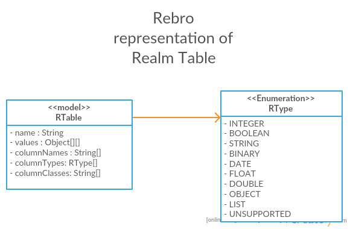

# Rebro Client

``demo`` — demo application

``rebro-client`` — Rebro android library

## Install
Add ``rebro-client`` library as a dependency to your ``build.gradle`` file.
```
repositories {
    maven {
        url "http://dl.bintray.com/ghedeon/maven"
    }
}

...

dependencies {
    debugCompile 'com.ghedeon:rebro-client:0.1.1'
}
```
## Usage
Well... use it! No additional setup is required.

## Implementation details


## License
GNU GPLv3
